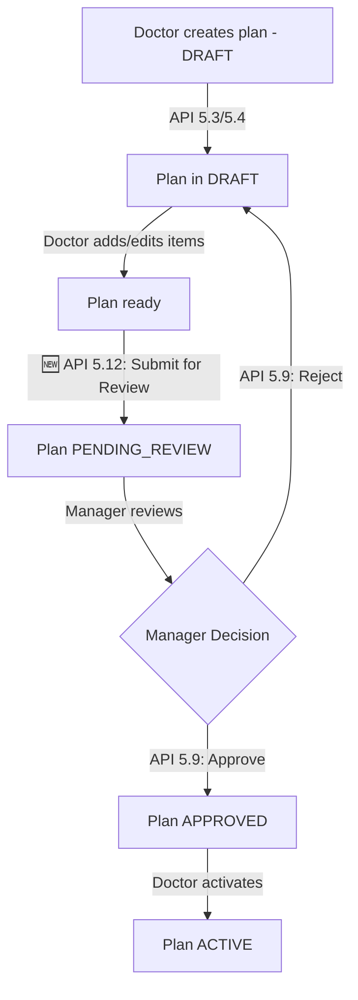

# ✅ Frontend Issues Fixed - New APIs Implementation Complete

**Date**: November 17, 2025
**Branch**: `feat/BE-501-manage-treatment-plans`
**Status**: ✅ **BUILD SUCCESS** - Ready for Testing

---

## 📋 Summary

Implemented **2 critical missing APIs** requested by Frontend team:

1. **🔴 API 5.12** - Submit Treatment Plan for Review (CRITICAL)
2. **🟡 API 6.6** - List Treatment Plan Templates (MEDIUM)

---

## 🔴 API 5.12: Submit Treatment Plan for Review

### Problem Solved

**Frontend Issue**: Doctors cannot submit DRAFT plans for manager approval

- **Symptom**: Manager tries to approve → 409 CONFLICT "Chỉ duyệt được lộ trình 'Chờ duyệt'"
- **Root Cause**: No API exists to change DRAFT → PENDING_REVIEW
- **Impact**: Entire treatment plan approval workflow blocked

### Implementation

**Endpoint**: `PATCH /api/v1/patient-treatment-plans/{planCode}/submit-for-review`

**Method**: `PATCH`

**Permissions**: `CREATE_TREATMENT_PLAN` OR `UPDATE_TREATMENT_PLAN` (Doctors)

**Request Body** (Optional):

```json
{
  "notes": "Lộ trình đã hoàn thiện, xin gửi duyệt" // Max 1000 chars, optional
}
```

**Response** (200 OK):

```json
{
  "planCode": "PLAN-20251111-002",
  "approvalStatus": "PENDING_REVIEW", // Changed from DRAFT
  "approvalMetadata": {
    "submittedBy": "Dr. Nguyễn Văn A",
    "submittedAt": "2025-11-17T15:30:00"
  }
  // ... other plan details
}
```

### Business Logic

**Validation Guards** (will throw errors if violated):

1. ✅ Plan must exist (404 NOT_FOUND)
2. ✅ Plan must be in DRAFT status (409 CONFLICT if already submitted)
3. ✅ Plan must have at least 1 phase (400 BAD_REQUEST)
4. ✅ Plan must have at least 1 item in phases (400 BAD_REQUEST)

**What happens**:

1. Validates all guards above
2. Changes status: `DRAFT` → `PENDING_REVIEW`
3. Records who submitted (current employee)
4. Creates audit log with action type: `SUBMITTED_FOR_REVIEW`
5. Returns updated plan detail with approval metadata

**Audit Trail**:

```sql
INSERT INTO plan_audit_logs (
    plan_id,
    action_type,           -- 'SUBMITTED_FOR_REVIEW'
    performed_by,          -- Doctor's employee_id
    old_approval_status,   -- 'DRAFT'
    new_approval_status,   -- 'PENDING_REVIEW'
    notes,                 -- From request or default message
    created_at
)
```

### Error Responses

| Code    | Condition                      | Message                                              |
| ------- | ------------------------------ | ---------------------------------------------------- |
| **400** | Plan has no phases or no items | "Lộ trình phải có ít nhất 1 giai đoạn và 1 hạng mục" |
| **403** | Insufficient permissions       | "Access denied"                                      |
| **404** | Plan not found                 | "Treatment plan not found: {planCode}"               |
| **409** | Plan not in DRAFT              | "Chỉ có thể gửi duyệt lộ trình ở trạng thái DRAFT"   |

### Testing Examples

#### ✅ Success Case

```bash
# 1. Create plan in DRAFT (API 5.3 or 5.4)
POST /api/v1/patient-treatment-plans
# ... plan created with status=DRAFT

# 2. Submit for review
PATCH /api/v1/patient-treatment-plans/PLAN-20251111-002/submit-for-review
Content-Type: application/json

{
  "notes": "Lộ trình đã hoàn thiện"
}

# ✅ Response 200: status changed to PENDING_REVIEW
```

#### ❌ Error Case 1: Already Submitted

```bash
PATCH /api/v1/patient-treatment-plans/PLAN-20251111-002/submit-for-review

# ❌ Response 409: Plan already in PENDING_REVIEW
```

#### ❌ Error Case 2: Plan has no items

```bash
# Plan only has phases but no items
PATCH /api/v1/patient-treatment-plans/PLAN-20251111-003/submit-for-review

# ❌ Response 400: Plan has no items
```

---

## 🟡 API 6.6: List Treatment Plan Templates

### Problem Solved

**Frontend Request**: Need API to list all templates with filters for scalability

- **Current**: Only API 5.8 (get single template by code)
- **Needed**: List all templates, filter by specialization, pagination
- **Use Case**: Dropdown, template management, filter by department

### Implementation

**Endpoint**: `GET /api/v1/treatment-plan-templates`

**Method**: `GET`

**Permissions**: `CREATE_TREATMENT_PLAN` (same as API 5.8)

**Query Parameters** (All Optional):

| Parameter          | Type    | Description              | Example                       |
| ------------------ | ------- | ------------------------ | ----------------------------- |
| `isActive`         | Boolean | Filter by active status  | `true` / `false` / null (all) |
| `specializationId` | Integer | Filter by specialization | `1` (Chỉnh nha)               |
| `page`             | Integer | Zero-based page number   | `0` (default)                 |
| `size`             | Integer | Items per page           | `20` (default)                |
| `sort`             | String  | Sort criteria            | `templateName,asc`            |

**Response** (200 OK):

```json
{
  "content": [
    {
      "templateId": 1,
      "templateCode": "TPL_ORTHO_METAL",
      "templateName": "Gói Niềng Răng Mắc Cài Kim Loại (Cơ bản)",
      "description": "Gói điều trị chỉnh nha toàn diện với mắc cài kim loại...",
      "estimatedTotalCost": 30000000,
      "estimatedDurationDays": 730,
      "isActive": true,
      "specialization": {
        "id": 1,
        "name": "Chỉnh nha"
      },
      "createdAt": "2025-01-01T10:00:00"
    },
    {
      "templateId": 2,
      "templateCode": "TPL_IMPLANT_OSSTEM",
      "templateName": "Gói Trồng Răng Implant Osstem (Hàn Quốc)",
      "description": "Gói trồng răng implant Osstem hoàn chỉnh...",
      "estimatedTotalCost": 15000000,
      "estimatedDurationDays": 180,
      "isActive": true,
      "specialization": {
        "id": 5,
        "name": "Phẫu thuật hàm mặt"
      },
      "createdAt": "2025-01-15T10:00:00"
    }
  ],
  "pageable": {
    "pageNumber": 0,
    "pageSize": 20,
    "sort": {
      "sorted": true,
      "orders": [
        {
          "property": "templateName",
          "direction": "ASC"
        }
      ]
    }
  },
  "totalElements": 2,
  "totalPages": 1,
  "last": true,
  "first": true,
  "number": 0,
  "size": 20,
  "numberOfElements": 2
}
```

### Filtering Examples

#### Example 1: Get All Active Templates

```bash
GET /api/v1/treatment-plan-templates?isActive=true&page=0&size=10
```

#### Example 2: Get Orthodontic Templates Only

```bash
GET /api/v1/treatment-plan-templates?specializationId=1&isActive=true
```

#### Example 3: Get All Templates (No Filters)

```bash
GET /api/v1/treatment-plan-templates?page=0&size=20
```

#### Example 4: Get Inactive Templates for Admin

```bash
GET /api/v1/treatment-plan-templates?isActive=false
```

#### Example 5: Sort by Name

```bash
GET /api/v1/treatment-plan-templates?sort=templateName,asc
```

### Response vs API 5.8

| Feature               | API 5.8 (Detail)                   | API 6.6 (List)                      |
| --------------------- | ---------------------------------- | ----------------------------------- |
| **Endpoint**          | `/treatment-plan-templates/{code}` | `/treatment-plan-templates`         |
| **Purpose**           | Get full template structure        | Get template summaries              |
| **Includes Phases**   | ✅ Yes                             | ❌ No (lightweight)                 |
| **Includes Services** | ✅ Yes                             | ❌ No (lightweight)                 |
| **Pagination**        | ❌ No (single item)                | ✅ Yes                              |
| **Filters**           | ❌ No                              | ✅ Yes (isActive, specializationId) |
| **Use Case**          | Load template to customize         | List templates for selection        |

**💡 Workflow**: Use API 6.6 to list → User selects → Use API 5.8 to get full detail

---

## 📊 Files Changed

### ✅ New Files Created (2)

1. **`SubmitForReviewRequest.java`** (NEW)

   - Location: `dto/request/SubmitForReviewRequest.java`
   - Purpose: Request DTO for API 5.12
   - Fields: `notes` (optional, max 1000 chars)

2. **`TemplateSummaryDTO.java`** (NEW)
   - Location: `dto/response/TemplateSummaryDTO.java`
   - Purpose: Response DTO for API 6.6 list endpoint
   - Fields: All template metadata (no phases/services)

### ✅ Files Modified (4)

3. **`TreatmentPlanApprovalService.java`** (MODIFIED)

   - Added: `submitForReview(planCode, request)` method (~120 lines)
   - Business logic: Validate → Change status → Audit log

4. **`TreatmentPlanTemplateService.java`** (MODIFIED)

   - Added: `getAllTemplates(isActive, specializationId, pageable)` method
   - Added: `mapToSummaryDTO(template)` helper method

5. **`TreatmentPlanTemplateRepository.java`** (MODIFIED)

   - Added: `findAllWithFilters(@Param isActive, @Param specializationId, Pageable)` query
   - Uses LEFT JOIN FETCH for specialization

6. **`TreatmentPlanController.java`** (MODIFIED)
   - Added: API 5.12 endpoint - `PATCH /patient-treatment-plans/{planCode}/submit-for-review`
   - Added: API 6.6 endpoint - `GET /treatment-plan-templates`
   - Full Swagger documentation for both

---

## 🧪 Testing Guide

### Prerequisites

```bash
# 1. Ensure application is running
cd /d/Code/PDCMS_BE
./mvnw spring-boot:run

# 2. Get JWT token (login as doctor or manager)
POST http://localhost:8080/api/v1/auth/login
{
  "username": "doctor01",
  "password": "password"
}
```

### Test API 5.12 (Submit for Review)

#### Setup: Create a DRAFT plan first

```bash
# Use API 5.3 or 5.4 to create a plan
POST http://localhost:8080/api/v1/patient-treatment-plans
Authorization: Bearer {token}
Content-Type: application/json

{
  "patientId": 1,
  "templateCode": "TPL_ORTHO_METAL",
  "startDate": "2025-11-20"
}

# Note the planCode from response (e.g., "PLAN-20251117-001")
```

#### Test Case 1: Success - Submit for review

```bash
PATCH http://localhost:8080/api/v1/patient-treatment-plans/PLAN-20251117-001/submit-for-review
Authorization: Bearer {token}
Content-Type: application/json

{
  "notes": "Lộ trình đã hoàn thiện, xin gửi quản lý duyệt"
}

# ✅ Expected: 200 OK
# Response: approvalStatus = "PENDING_REVIEW"
```

#### Test Case 2: Verify audit log

```sql
-- Check database
SELECT * FROM plan_audit_logs
WHERE plan_id = (SELECT plan_id FROM patient_treatment_plans WHERE plan_code = 'PLAN-20251117-001')
ORDER BY created_at DESC
LIMIT 1;

-- Expected:
-- action_type = 'SUBMITTED_FOR_REVIEW'
-- old_approval_status = 'DRAFT'
-- new_approval_status = 'PENDING_REVIEW'
```

#### Test Case 3: Error - Already submitted

```bash
# Try to submit again
PATCH http://localhost:8080/api/v1/patient-treatment-plans/PLAN-20251117-001/submit-for-review
Authorization: Bearer {token}

# ❌ Expected: 409 CONFLICT
# Message: "Chỉ có thể gửi duyệt lộ trình ở trạng thái DRAFT"
```

### Test API 6.6 (List Templates)

#### Test Case 1: Get all active templates

```bash
GET http://localhost:8080/api/v1/treatment-plan-templates?isActive=true&page=0&size=10
Authorization: Bearer {token}

# ✅ Expected: 200 OK
# Response: Paginated list of active templates
```

#### Test Case 2: Filter by specialization

```bash
GET http://localhost:8080/api/v1/treatment-plan-templates?specializationId=1&isActive=true
Authorization: Bearer {token}

# ✅ Expected: 200 OK
# Response: Only orthodontic templates (Chỉnh nha)
```

#### Test Case 3: Get all templates (no filter)

```bash
GET http://localhost:8080/api/v1/treatment-plan-templates?page=0&size=20
Authorization: Bearer {token}

# ✅ Expected: 200 OK
# Response: All templates (active + inactive)
```

#### Test Case 4: Pagination

```bash
GET http://localhost:8080/api/v1/treatment-plan-templates?page=1&size=5
Authorization: Bearer {token}

# ✅ Expected: 200 OK
# Response: Page 2 (items 6-10)
```

#### Test Case 5: Sorting

```bash
GET http://localhost:8080/api/v1/treatment-plan-templates?sort=templateName,asc
Authorization: Bearer {token}

# ✅ Expected: 200 OK
# Response: Templates sorted alphabetically
```

---

## 🔗 Workflow Integration

### Complete Treatment Plan Workflow (with new APIs)



### New Frontend Flow

**Step 1**: Doctor creates/edits plan

```javascript
// Create from template (API 5.3)
POST /api/v1/patient-treatment-plans
{
  "patientId": 1,
  "templateCode": "TPL_ORTHO_METAL",  // Selected from API 6.6 list
  "startDate": "2025-11-20"
}
// → Plan created with status=DRAFT
```

**Step 2**: Doctor submits for approval (NEW - API 5.12)

```javascript
PATCH /api/v1/patient-treatment-plans/PLAN-20251117-001/submit-for-review
{
  "notes": "Lộ trình đã hoàn thiện"
}
// → Status changed: DRAFT → PENDING_REVIEW
```

**Step 3**: Manager approves (existing API 5.9)

```javascript
PATCH /api/v1/patient-treatment-plans/PLAN-20251117-001/approval
{
  "approvalStatus": "APPROVED",
  "notes": "Đã duyệt"
}
// → Status changed: PENDING_REVIEW → APPROVED
```

---

## 📝 Swagger Documentation

Both APIs are fully documented in Swagger UI:

**Access**: `http://localhost:8080/swagger-ui/index.html`

**Endpoints**:

- `PATCH /api/v1/patient-treatment-plans/{planCode}/submit-for-review` (API 5.12)
- `GET /api/v1/treatment-plan-templates` (API 6.6)

**Try it out**: Use "Try it out" button in Swagger UI to test directly

---

## ✅ Compilation Status

```bash
$ ./mvnw clean compile -DskipTests

[INFO] BUILD SUCCESS
[INFO] Total time:  01:10 min
[INFO] Finished at: 2025-11-17T15:59:20
```

**All files compile successfully!** ✅

---

## 🚀 Next Steps

1. **Start Application**:

   ```bash
   cd /d/Code/PDCMS_BE
   ./mvnw spring-boot:run
   ```

2. **Test APIs**: Follow testing guide above

3. **Frontend Integration**:

   - Update treatment plan submission flow to use API 5.12
   - Add template list dropdown using API 6.6
   - Update approval workflow to match new status transitions

4. **Database Verification**:
   - Check audit logs after submit/approve actions
   - Verify status transitions

---

## 📞 Contact

**Issues or Questions?** Contact Backend team:

- Branch: `feat/BE-501-manage-treatment-plans`
- Status: Ready for testing
- Build: SUCCESS ✅

---

**Implemented by**: Backend Team
**Date**: November 17, 2025
**Version**: V21 Treatment Plans
