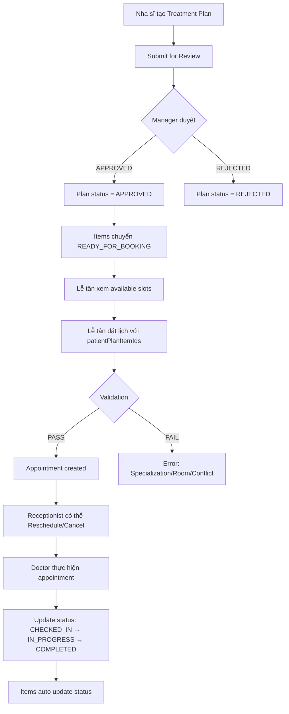

# 🏥 TREATMENT PLAN → BOOKING FLOW - PHÂN TÍCH TOÀN BỘ & HƯỚNG DẪN FE

> **Ngày tạo:** 2025-11-20  
> **Mục đích:** Kiểm tra kỹ toàn bộ flow từ Treatment Plan → Booking Appointment, phát hiện lỗi seed data, business logic, và cung cấp hướng dẫn đầy đủ cho FE team

---

## 📋 MỤC LỤC

1. [Tổng Quan Flow](#1-tổng-quan-flow)
2. [Phân Tích Seed Data - CÁC VẤN ĐỀ NGHIÊM TRỌNG](#2-phân-tích-seed-data---các-vấn-đề-nghiêm-trọng)
3. [Flow 1: Nha Sĩ Tạo Treatment Plan](#3-flow-1-nha-sĩ-tạo-treatment-plan)
4. [Flow 2: Manager Duyệt Treatment Plan](#4-flow-2-manager-duyệt-treatment-plan)
5. [Flow 3: Lễ Tân Booking từ Treatment Plan](#5-flow-3-lễ-tân-booking-từ-treatment-plan)
6. [Flow 4: Quản Lý Lịch Hẹn (Reschedule/Cancel)](#6-flow-4-quản-lý-lịch-hẹn-reschedulecancel)
7. [Flow 5: Thực Hiện và Hoàn Thành Appointment](#7-flow-5-thực-hiện-và-hoàn-thành-appointment)
8. [Business Rules & Validations Chi Tiết](#8-business-rules--validations-chi-tiết)
9. [Checklist Cho FE Team](#9-checklist-cho-fe-team)

---

## 1. TỔNG QUAN FLOW

### 1.1. Luồng Đầy Đủ



### 1.2. Các Roles & Permissions

| Role | Username | Permissions | Chức năng |
|------|----------|-------------|-----------|
| **DENTIST** | nhasi1, nhasi2 | `CREATE_TREATMENT_PLAN`, `VIEW_TREATMENT_PLAN_OWN` | Tạo plan, xem plan của mình |
| **MANAGER** | quanli1 | `APPROVE_TREATMENT_PLAN`, `VIEW_TREATMENT_PLAN_ALL` | Duyệt/từ chối plan |
| **RECEPTIONIST** | letan1, letan2 | `CREATE_APPOINTMENT`, `VIEW_AVAILABLE_SLOTS` | Đặt lịch từ plan |
| **PATIENT** | benhnhan1-5 | `VIEW_TREATMENT_PLAN_OWN`, `VIEW_APPOINTMENT_OWN` | Xem plan và lịch hẹn của mình |

---

## 2. PHÂN TÍCH SEED DATA - CÁC VẤN ĐỀ NGHIÊM TRỌNG

### ⚠️ 2.1. VẤN ĐỀ 1: IMPLANT PLAN - CREATOR KHÔNG CÓ CHUYÊN MÔN

**Seed Data Hiện Tại:**

```sql
-- Treatment Plan 2: Bệnh nhân BN-1002 - Implant
INSERT INTO patient_treatment_plans (
    plan_id, plan_code, plan_name, patient_id, created_by, ...
) VALUES (
    2, 'PLAN-20240515-001', 'Lộ trình Implant 2 răng cửa', 2, 2, ...
    -- created_by = 2 → Dentist 2 (Trịnh Công Thái)
)
```

**Specializations:**

```sql
INSERT INTO employee_specializations (employee_id, specialization_id)
VALUES
-- Dentist 1: Lê Anh Khoa (ID=1) - Chỉnh nha (1) + Nha chu (3) + Phục hồi (4) + STANDARD (8)
(1, 1), (1, 3), (1, 4), (1, 8),

-- Dentist 2: Trịnh Công Thái (ID=2) - Nội nha (2) + Răng thẩm mỹ (7) + STANDARD (8)
(2, 2), (2, 7), (2, 8),  -- ❌ KHÔNG CÓ spec 5 (Phẫu thuật hàm mặt)

-- Dentist 3: Jimmy Donaldson (ID=3) - Nha khoa trẻ em (6) + STANDARD (8)
(3, 6), (3, 8),

-- Dentist 4: Junya Ota (ID=4) - Phẫu thuật hàm mặt (5) + Phục hồi (4) + STANDARD (8)
(4, 4), (4, 5), (4, 8)   -- ✅ DUY NHẤT có spec 5!
```

**Services IMPLANT yêu cầu:**

```sql
-- ALL Implant services require specialization_id = 5
('IMPL_SURGERY_KR', ..., 5, 'C_IMPLANT', ...),
('IMPL_SURGERY_EUUS', ..., 5, 'C_IMPLANT', ...),
('IMPL_BONE_GRAFT', ..., 5, 'C_IMPLANT', ...),
('IMPL_SINUS_LIFT', ..., 5, 'C_IMPLANT', ...),
```

**❌ BUSINESS LOGIC VI PHẠM:**

1. **Dentist 2 KHÔNG THỂ tạo Implant plan** vì không có specialization 5
2. Khi booking appointment với Implant services, system sẽ:
   - ❌ REJECT nếu doctor không có spec 5
   - ❌ Lễ tân không thể đặt lịch cho Dentist 2 làm Implant

**✅ GIẢI PHÁP:**

```sql
-- Option 1: Đổi creator từ Dentist 2 → Dentist 4 (có spec 5)
UPDATE patient_treatment_plans 
SET created_by = 4  -- Junya Ota has specialization 5
WHERE plan_id = 2;

-- Option 2: Thêm spec 5 cho Dentist 2
INSERT INTO employee_specializations (employee_id, specialization_id)
VALUES (2, 5)  -- Give Dentist 2 Implant specialization
ON CONFLICT DO NOTHING;
```

---

### ⚠️ 2.2. VẤN ĐỀ 2: ORTHODONTICS PLAN - NIỀNG RĂNG

**Seed Data:**

```sql
-- Treatment Plan 1: Bệnh nhân BN-1001 - Niềng răng
INSERT INTO patient_treatment_plans (
    plan_id, plan_code, plan_name, patient_id, created_by, ...
) VALUES (
    1, 'PLAN-20251001-001', 'Lộ trình Niềng răng Mắc cài Kim loại', 1, 1, ...
    -- created_by = 1 → Dentist 1 (Lê Anh Khoa)
)

-- Items trong plan:
INSERT INTO patient_plan_items (item_id, phase_id, service_id, ...)
VALUES
    (1, 1, 1, ...), -- service_id = 1 → GEN_EXAM
    (2, 1, 3, ...), -- service_id = 3 → SCALING_L2 (Cạo vôi)
    (4, 2, 38, ...), -- service_id = 38 → ORTHO_BRACES_METAL?
    (6, 2, 39, ...), -- service_id = 39 → ORTHO_ADJUST?
```

**Kiểm tra Services:**

```sql
-- Orthodontic services require specialization_id = 1
('ORTHO_BRACES_ON', ..., 1, 'D_ORTHO', ...),  -- spec 1
('ORTHO_ADJUST', ..., 1, 'D_ORTHO', ...),     -- spec 1
```

**Kiểm tra Dentist 1:**

```sql
(1, 1), (1, 3), (1, 4), (1, 8)
-- ✅ Dentist 1 CÓ specialization 1 (Chỉnh nha)
```

**✅ STATUS: VALID** - Dentist 1 có chuyên môn làm Niềng răng

---

### ⚠️ 2.3. VẤN ĐỀ 3: ROOM-SERVICES COMPATIBILITY

**Rooms Hiện Tại:**

```sql
INSERT INTO rooms (room_id, room_code, room_name, room_type, ...)
VALUES
('P-01', 'P-01', 'Phòng 1 - Standard', 'STANDARD', ...),
('P-02', 'P-02', 'Phòng 2 - Standard', 'STANDARD', ...),
('P-03', 'P-03', 'Phòng 3 - Standard', 'STANDARD', ...),
('P-04', 'P-IMPLANT-01', 'Phòng 4 - Implant', 'IMPLANT', ...);
```

**Room-Services Mapping:**

```sql
-- STANDARD rooms → KHÔNG SUPPORT Implant services
(r.room_type = 'STANDARD' AND s.service_code IN (
    'GEN_EXAM', 'SCALING_L1', ..., 'ORTHO_ADJUST', ...
    -- ❌ KHÔNG CÓ 'IMPL_SURGERY_KR', 'IMPL_SINUS_LIFT', etc.
))

-- IMPLANT room → Support ALL services (STANDARD + IMPLANT)
(r.room_type = 'IMPLANT' AND s.service_code IN (
    ..., 'IMPL_SURGERY_KR', 'IMPL_SINUS_LIFT', ...
))
```

**❌ VẤN ĐỀ:**

Khi đặt lịch Implant services, **CHỈ CÓ THỂ dùng room P-04** (IMPLANT room). Nếu FE cho chọn P-01, P-02, P-03 → API sẽ reject:

```json
{
  "statusCode": 400,
  "error": "error.appointment.room_not_support_services",
  "message": "Room P-01 does not support service IMPL_SURGERY_KR"
}
```

**✅ HƯỚNG DẪN FE:**

1. **Khi fetch available slots**, filter rooms theo service requirements:
   - Nếu có Implant services → CHỈ hiển thị P-04
   - Nếu toàn services thông thường → Hiển thị cả 4 phòng
2. **API 3.1 Get Available Slots** tự động filter room compatibility

---

### ⚠️ 2.4. VẤN ĐỀ 4: ITEMS STATUS READY_FOR_BOOKING

**Seed Data:**

```sql
INSERT INTO patient_plan_items (item_id, phase_id, service_id, ..., status, ...)
VALUES
    -- Phase 2: Items 6, 7 - READY_FOR_BOOKING ✅
    (6, 2, 39, ..., 'READY_FOR_BOOKING', ...),
    (7, 2, 39, ..., 'READY_FOR_BOOKING', ...),
    
    -- Phase 3: Items 8-15 - READY_FOR_BOOKING ✅
    (8, 3, 39, ..., 'READY_FOR_BOOKING', ...),
    (9, 3, 39, ..., 'READY_FOR_BOOKING', ...),
    ...
```

**✅ STATUS: VALID** - Có nhiều items READY_FOR_BOOKING để test

---

### 📊 2.5. BẢNG TỔNG HỢP SEED DATA ISSUES

| Issue | Severity | Mô tả | Impact | Fix |
|-------|----------|-------|--------|-----|
| **Implant Creator** | 🔴 CRITICAL | Dentist 2 tạo Implant plan nhưng không có spec 5 | Booking sẽ FAIL | Đổi creator → Dentist 4 hoặc thêm spec |
| **Room Compatibility** | 🟡 MEDIUM | Implant chỉ làm được ở P-04 | FE cần filter rooms | Document cho FE |
| **Specialization Gaps** | 🟡 MEDIUM | Chỉ 1 dentist có spec 5 (Implant) | Limited availability | Thêm dentists hoặc spec |
| **Orthodontics** | 🟢 OK | Dentist 1 có spec 1 | No issue | - |
| **Items Status** | 🟢 OK | Có đủ items READY_FOR_BOOKING | No issue | - |

---

## 3. FLOW 1: NHA SĨ TẠO TREATMENT PLAN

### 3.1. API 5.1 - Create Treatment Plan

**Endpoint:**
```
POST /api/v1/treatment-plans/patients/{patientCode}
Authorization: Bearer <dentist_token>
```

**Request Body:**

```json
{
  "planName": "Lộ trình Implant 1 răng",
  "startDate": "2025-11-25",
  "expectedEndDate": "2026-02-25",
  "paymentType": "INSTALLMENT",
  "phases": [
    {
      "phaseNumber": 1,
      "phaseName": "Giai đoạn 1: Chuẩn bị",
      "estimatedDurationDays": 14,
      "items": [
        {
          "sequenceNumber": 1,
          "serviceCode": "GEN_EXAM",
          "itemName": "Khám tổng quát",
          "estimatedTimeMinutes": 30,
          "price": 500000
        },
        {
          "sequenceNumber": 2,
          "serviceCode": "IMPL_CT_SCAN",
          "itemName": "Chụp CT 3D Implant",
          "estimatedTimeMinutes": 45,
          "price": 1500000
        }
      ]
    },
    {
      "phaseNumber": 2,
      "phaseName": "Giai đoạn 2: Cấy Implant",
      "estimatedDurationDays": 90,
      "items": [
        {
          "sequenceNumber": 1,
          "serviceCode": "IMPL_SURGERY_KR",
          "itemName": "Cấy trụ Implant Hàn Quốc",
          "estimatedTimeMinutes": 90,
          "price": 12000000
        }
      ]
    }
  ]
}
```

**Response Success (201):**

```json
{
  "statusCode": 201,
  "message": "Treatment plan created successfully",
  "data": {
    "planCode": "PLAN-20251125-003",
    "planName": "Lộ trình Implant 1 răng",
    "patientCode": "BN-1003",
    "status": "DRAFT",
    "approvalStatus": "DRAFT",
    "createdBy": {
      "employeeCode": "EMP004",
      "fullName": "Junya Ota"
    },
    "totalPrice": 14000000,
    "finalCost": 14000000,
    "createdAt": "2025-11-20T10:30:00"
  }
}
```

**Business Rules:**

1. ✅ **Creator Validation:**
   - System tự động set `created_by` = current employee ID
   - Permission: `CREATE_TREATMENT_PLAN`

2. ✅ **Service Validation:**
   - Tất cả `serviceCode` phải tồn tại và `is_active = true`
   - ❌ **KHÔNG VALIDATE** specialization lúc tạo plan (chỉ validate khi booking)

3. ✅ **Initial Status:**
   - `status` = "DRAFT"
   - `approval_status` = "DRAFT"
   - Items: `status` = "PENDING"

---

### 3.2. API 5.2 - Submit Plan for Review

**Endpoint:**
```
POST /api/v1/treatment-plans/patients/{patientCode}/plans/{planCode}/submit
Authorization: Bearer <dentist_token>
```

**Response Success (200):**

```json
{
  "statusCode": 200,
  "message": "Treatment plan submitted for review successfully",
  "data": {
    "planCode": "PLAN-20251125-003",
    "approvalStatus": "PENDING_REVIEW",
    "submittedAt": "2025-11-20T10:35:00"
  }
}
```

**Business Rules:**

1. ✅ Chỉ creator mới có thể submit (hoặc admin)
2. ✅ Plan phải ở trạng thái `DRAFT`
3. ✅ Sau submit: `approval_status` → `PENDING_REVIEW`

---

## 4. FLOW 2: MANAGER DUYỆT TREATMENT PLAN

### 4.1. API 5.9 - Approve/Reject Plan

**Endpoint:**
```
PATCH /api/v1/treatment-plans/patients/{patientCode}/plans/{planCode}/approval
Authorization: Bearer <manager_token>
```

**Request Body (APPROVE):**

```json
{
  "isApproval": true,
  "notes": "Plan hợp lý, phù hợp với tình trạng bệnh nhân"
}
```

**Request Body (REJECT):**

```json
{
  "isApproval": false,
  "notes": "Cần bổ sung thêm dịch vụ cạo vôi trước khi cấy Implant"
}
```

**Response Success - APPROVED (200):**

```json
{
  "statusCode": 200,
  "message": "Treatment plan approved successfully",
  "data": {
    "planCode": "PLAN-20251125-003",
    "approvalStatus": "APPROVED",
    "approvedBy": {
      "employeeCode": "EMP011",
      "fullName": "Quản Lý 1"
    },
    "approvedAt": "2025-11-20T14:00:00",
    "notes": "Plan hợp lý, phù hợp với tình trạng bệnh nhân"
  }
}
```

**Business Rules:**

1. ✅ **Permission:** `APPROVE_TREATMENT_PLAN`
2. ✅ **Status Flow:**
   - APPROVED: `approval_status` → `APPROVED`, items → `READY_FOR_BOOKING`
   - REJECTED: `approval_status` → `REJECTED`, items không đổi
3. ✅ **Audit Log:** Tạo record trong `plan_audit_logs`
4. ❌ **REMOVED:** Không còn validation zero-price (FE Issue #3 fix)

---

### 4.2. API 5.8 - Get Treatment Plan Details

**Endpoint:**
```
GET /api/v1/treatment-plans/patients/{patientCode}/treatment-plans/{planCode}
Authorization: Bearer <token>
```

**Response Success (200):**

```json
{
  "statusCode": 200,
  "data": {
    "planCode": "PLAN-20251001-001",
    "planName": "Lộ trình Niềng răng Mắc cài Kim loại",
    "patientCode": "BN-1001",
    "patientName": "Đoàn Thanh Phong",
    "status": "IN_PROGRESS",
    "approvalStatus": "APPROVED",
    "startDate": "2025-10-01",
    "expectedEndDate": "2027-10-01",
    "totalPrice": 35000000,
    "discountAmount": 0,
    "finalCost": 35000000,
    "paymentType": "INSTALLMENT",
    
    "approvalMetadata": {
      "approvedBy": {
        "employeeCode": "EMP003",
        "fullName": "Jimmy Donaldson"
      },
      "approvedAt": "2025-10-02T09:00:00",
      "notes": "Plan phù hợp với tình trạng răng miệng"
    },
    
    "phases": [
      {
        "phaseNumber": 1,
        "phaseName": "Giai đoạn 1: Chuẩn bị và Kiểm tra",
        "status": "COMPLETED",
        "startDate": "2025-10-01",
        "completionDate": "2025-10-06",
        "items": [
          {
            "patientPlanItemId": 1,
            "sequenceNumber": 1,
            "serviceCode": "GEN_EXAM",
            "serviceName": "Khám tổng quát và chụp X-quang",
            "itemName": "Khám tổng quát và chụp X-quang",
            "status": "COMPLETED",
            "estimatedTimeMinutes": 30,
            "price": 500000,
            "completedAt": "2025-10-02T09:00:00"
          }
        ]
      },
      {
        "phaseNumber": 2,
        "phaseName": "Giai đoạn 2: Lắp Mắc cài",
        "status": "IN_PROGRESS",
        "startDate": "2025-10-15",
        "items": [
          {
            "patientPlanItemId": 6,
            "sequenceNumber": 3,
            "serviceCode": "ORTHO_ADJUST",
            "serviceName": "Tái khám Chỉnh nha / Siết niềng",
            "itemName": "Điều chỉnh lần 1",
            "status": "READY_FOR_BOOKING",
            "estimatedTimeMinutes": 45,
            "price": 500000,
            "completedAt": null
          },
          {
            "patientPlanItemId": 7,
            "sequenceNumber": 4,
            "serviceCode": "ORTHO_ADJUST",
            "serviceName": "Tái khám Chỉnh nha / Siết niềng",
            "itemName": "Điều chỉnh lần 2",
            "status": "READY_FOR_BOOKING",
            "estimatedTimeMinutes": 45,
            "price": 500000,
            "completedAt": null
          }
        ]
      }
    ],
    
    "progress": {
      "totalPhases": 3,
      "completedPhases": 1,
      "totalItems": 15,
      "completedItems": 3,
      "readyForBookingItems": 10
    }
  }
}
```

**✅ Phase 5 Enhancement:**

- Mỗi item có `serviceCode` và `serviceName` (không cần call thêm API)
- `patientPlanItemId` để dùng cho booking

---

## 5. FLOW 3: LỄ TÂN BOOKING TỪ TREATMENT PLAN

### 5.1. Workflow

```
1. FE hiển thị treatment plan details (API 5.8)
2. User chọn items READY_FOR_BOOKING để đặt lịch
3. FE call API 3.1 Get Available Slots với serviceCodes (để filter rooms)
4. User chọn time slot + room + doctor
5. FE call API 5.4 Create Appointment với patientPlanItemIds
```

---

### 5.2. API 3.1 - Get Available Time Slots

**Endpoint:**
```
GET /api/v1/appointments/available-slots?date=2025-11-25&serviceCodes=ORTHO_ADJUST&roomCode=P-01
```

**Response:**

```json
{
  "statusCode": 200,
  "data": {
    "date": "2025-11-25",
    "roomCode": "P-01",
    "roomName": "Phòng 1 - Standard",
    "slots": [
      {
        "slotStartTime": "2025-11-25T09:00:00",
        "slotEndTime": "2025-11-25T10:00:00",
        "availableDoctors": [
          {
            "employeeCode": "EMP001",
            "fullName": "Lê Anh Khoa",
            "specializations": ["Chỉnh nha", "Nha chu", "Phục hồi"]
          }
        ]
      }
    ]
  }
}
```

**⚠️ IMPORTANT:** 

- Nếu có Implant services → CHỈ query room P-04
- API tự động filter doctors theo specialization requirements

---

### 5.3. API 5.4 - Create Appointment (Treatment Plan Mode)

**Endpoint:**
```
POST /api/v1/appointments
Authorization: Bearer <receptionist_token>
```

**Request Body:**

```json
{
  "patientCode": "BN-1001",
  "employeeCode": "EMP001",
  "roomCode": "P-01",
  "patientPlanItemIds": [6, 7],
  "appointmentStartTime": "2025-11-25T09:00:00",
  "participantCodes": [],
  "notes": "Tái khám niềng răng tháng 3 và 4"
}
```

**⚠️ XOR Validation:**

```javascript
// FE MUST provide EITHER serviceCodes OR patientPlanItemIds, NOT BOTH
{
  "serviceCodes": ["SV-001"],           // Standalone booking
  "patientPlanItemIds": null
}

// OR

{
  "serviceCodes": null,
  "patientPlanItemIds": [6, 7],        // Treatment plan booking
}

// ❌ INVALID - Both provided
{
  "serviceCodes": ["SV-001"],
  "patientPlanItemIds": [6, 7]         // ERROR!
}
```

**Response Success (201):**

```json
{
  "statusCode": 201,
  "message": "Appointment created successfully",
  "data": {
    "appointmentCode": "APT-20251125-001",
    "patientCode": "BN-1001",
    "doctorCode": "EMP001",
    "doctorName": "Lê Anh Khoa",
    "roomCode": "P-01",
    "roomName": "Phòng 1 - Standard",
    "appointmentStartTime": "2025-11-25T09:00:00",
    "appointmentEndTime": "2025-11-25T10:30:00",
    "status": "SCHEDULED",
    "services": [
      {
        "serviceCode": "ORTHO_ADJUST",
        "serviceName": "Tái khám Chỉnh nha / Siết niềng",
        "durationMinutes": 45,
        "patientPlanItemId": 6
      },
      {
        "serviceCode": "ORTHO_ADJUST",
        "serviceName": "Tái khám Chỉnh nha / Siết niềng",
        "durationMinutes": 45,
        "patientPlanItemId": 7
      }
    ]
  }
}
```

**Business Logic:**

1. ✅ **Items Validation:**
   - Tất cả `patientPlanItemIds` phải:
     - Tồn tại
     - Thuộc về patient trong request
     - Có status = `READY_FOR_BOOKING`
     - Thuộc plan đã APPROVED

2. ✅ **Doctor Specialization Check:**
   ```sql
   -- System checks doctor has ALL required specializations
   SELECT COUNT(DISTINCT s.specialization_id) 
   FROM services s 
   WHERE s.service_id IN (SELECT service_id FROM patient_plan_items WHERE item_id IN (...))
   
   -- Must match:
   SELECT COUNT(*) 
   FROM employee_specializations es 
   WHERE es.employee_id = ? 
     AND es.specialization_id IN (...)
   ```

3. ✅ **Room Compatibility Check:**
   ```sql
   -- ALL services must be in room_services for selected room
   SELECT COUNT(*) FROM room_services rs
   WHERE rs.room_id = ?
     AND rs.service_id IN (...)
   ```

4. ✅ **Conflict Detection:**
   - Doctor không có appointment khác cùng thời gian
   - Room không bị occupied
   - Patient không có appointment khác cùng thời gian

5. ✅ **Item Status Update:**
   - Sau khi tạo appointment thành công:
   - Items → `status` = "BOOKED"
   - Plan → `status` = "IN_PROGRESS" (nếu chưa phải)

---

### 5.4. Common Errors

```json
// ERROR 1: XOR Validation Failed
{
  "statusCode": 400,
  "error": "error.validation",
  "message": "Please provide either serviceCodes (standalone booking) or patientPlanItemIds (treatment plan booking), but not both"
}

// ERROR 2: Item Not Ready
{
  "statusCode": 400,
  "error": "error.appointment.item_not_ready",
  "message": "Item ID 6 is not in READY_FOR_BOOKING status"
}

// ERROR 3: Doctor Missing Specialization
{
  "statusCode": 400,
  "error": "error.appointment.doctor_missing_specialization",
  "message": "Doctor EMP002 does not have required specialization: Phẫu thuật hàm mặt (ID: 5)"
}

// ERROR 4: Room Not Support Service
{
  "statusCode": 400,
  "error": "error.appointment.room_not_support_services",
  "message": "Room P-01 does not support service IMPL_SURGERY_KR"
}

// ERROR 5: Time Conflict
{
  "statusCode": 409,
  "error": "error.appointment.conflict",
  "message": "Doctor EMP001 already has appointment APT-20251125-002 at this time"
}
```

---

## 6. FLOW 4: QUẢN LÝ LỊCH HẸN (RESCHEDULE/CANCEL)

### 6.1. API 4.3 - Reschedule Appointment

**Endpoint:**
```
POST /api/v1/appointments/{appointmentCode}/reschedule
Authorization: Bearer <receptionist_token>
```

**Request Body:**

```json
{
  "newStartTime": "2025-11-26T14:00:00",
  "newDoctorCode": "EMP001",
  "newRoomCode": "P-01",
  "reasonCode": "PATIENT_REQUEST",
  "notes": "Bệnh nhân yêu cầu đổi lịch do bận công việc"
}
```

**Response Success (200):**

```json
{
  "statusCode": 200,
  "message": "Appointment rescheduled successfully",
  "data": {
    "appointmentCode": "APT-20251125-001",
    "oldStartTime": "2025-11-25T09:00:00",
    "newStartTime": "2025-11-26T14:00:00",
    "status": "SCHEDULED",
    "auditLogId": 123
  }
}
```

**Business Rules:**

1. ✅ Chỉ có thể reschedule appointment với status = `SCHEDULED`
2. ✅ Phải validate lại doctor specialization, room compatibility, conflicts
3. ✅ Tạo audit log với `action_type` = "RESCHEDULE_SOURCE" & "RESCHEDULE_TARGET"
4. ✅ **Items KHÔNG ĐỔI STATUS** - vẫn giữ "BOOKED"

---

### 6.2. API 4.4 - Cancel Appointment

**Endpoint:**
```
POST /api/v1/appointments/{appointmentCode}/cancel
Authorization: Bearer <receptionist_token>
```

**Request Body:**

```json
{
  "reasonCode": "PATIENT_REQUEST",
  "notes": "Bệnh nhân hủy lịch do lý do cá nhân"
}
```

**Response Success (200):**

```json
{
  "statusCode": 200,
  "message": "Appointment cancelled successfully",
  "data": {
    "appointmentCode": "APT-20251125-001",
    "status": "CANCELLED",
    "cancelledAt": "2025-11-20T16:00:00"
  }
}
```

**Business Rules:**

1. ✅ Appointment status → `CANCELLED`
2. ✅ **Items rollback:** `BOOKED` → `READY_FOR_BOOKING`
3. ✅ Tạo audit log với `action_type` = "CANCEL"

---

## 7. FLOW 5: THỰC HIỆN VÀ HOÀN THÀNH APPOINTMENT

### 7.1. API 4.5 - Update Appointment Status

**Endpoint:**
```
PATCH /api/v1/appointments/{appointmentCode}/status
Authorization: Bearer <receptionist_token>
```

**Request Body:**

```json
{
  "status": "CHECKED_IN"
}
```

**Status Flow:**

```
SCHEDULED → CHECKED_IN → IN_PROGRESS → COMPLETED
```

**Response Success (200):**

```json
{
  "statusCode": 200,
  "message": "Appointment status updated successfully",
  "data": {
    "appointmentCode": "APT-20251125-001",
    "oldStatus": "SCHEDULED",
    "newStatus": "CHECKED_IN",
    "updatedAt": "2025-11-25T08:55:00"
  }
}
```

**Business Rules:**

1. ✅ `CHECKED_IN` → `IN_PROGRESS`: Doctor bắt đầu điều trị
2. ✅ `IN_PROGRESS` → `COMPLETED`: Hoàn thành điều trị
3. ✅ **Auto Update Items:**
   - Khi appointment → `COMPLETED`
   - Tất cả items linked → `status` = "COMPLETED"
   - Set `completed_at` = current timestamp
4. ✅ **Auto Update Phase:**
   - Nếu tất cả items trong phase đều COMPLETED
   - Phase → `status` = "COMPLETED"
   - Set `completion_date`
5. ✅ **Auto Update Plan:**
   - Nếu tất cả phases đều COMPLETED
   - Plan → `status` = "COMPLETED"

---

## 8. BUSINESS RULES & VALIDATIONS CHI TIẾT

### 8.1. Specialization Matching

**Logic:**

```java
// Pseudo-code
Set<Integer> requiredSpecs = services.stream()
    .map(Service::getSpecializationId)
    .filter(Objects::nonNull)
    .collect(Collectors.toSet());

Set<Integer> doctorSpecs = employee.getSpecializations().stream()
    .map(Specialization::getSpecializationId)
    .collect(Collectors.toSet());

if (!doctorSpecs.containsAll(requiredSpecs)) {
    throw new BusinessException("Doctor missing required specializations");
}
```

**Example:**

```
Services: [IMPL_SURGERY_KR (spec 5), GEN_EXAM (spec 8)]
Required: [5, 8]
Doctor Specs: [2, 7, 8]  → ❌ MISSING spec 5
```

---

### 8.2. Room Compatibility

**Logic:**

```java
// ALL services must have mapping in room_services table
for (Service service : services) {
    if (!roomServiceRepository.existsByRoomIdAndServiceId(roomId, service.getId())) {
        throw new BusinessException("Room does not support service: " + service.getCode());
    }
}
```

---

### 8.3. Clinical Rules (Service Dependencies - V21)

**Example Rules:**

```sql
-- Rule 1: EXTRACT_WISDOM_L2 → SURG_CHECKUP (min 7 days apart)
INSERT INTO service_dependencies (service_id, dependent_service_id, rule_type, min_days_apart)
VALUES (
    (SELECT service_id FROM services WHERE service_code = 'EXTRACT_WISDOM_L2'),
    (SELECT service_id FROM services WHERE service_code = 'SURG_CHECKUP'),
    'REQUIRES_MIN_DAYS',
    7
);

-- Rule 2: EXTRACT_WISDOM_L2 EXCLUDES BLEACH_INOFFICE (same day)
INSERT INTO service_dependencies (service_id, dependent_service_id, rule_type)
VALUES (..., 'EXCLUDES_SAME_DAY');
```

**Enforcement:**

- ✅ Validated during appointment creation
- ❌ NOT validated during treatment plan creation (plan level)

---

### 8.4. Conflict Detection

**Checks:**

1. **Doctor Conflict:**
```sql
SELECT COUNT(*) FROM appointments 
WHERE employee_id = ? 
  AND status NOT IN ('CANCELLED', 'COMPLETED')
  AND (
    (appointment_start_time <= ? AND appointment_end_time > ?) OR
    (appointment_start_time < ? AND appointment_end_time >= ?)
  )
```

2. **Room Conflict:** Same query with `room_id`

3. **Patient Conflict:** Same query with `patient_id`

4. **Participant Conflict:** Check `appointment_participants` table

---

## 9. CHECKLIST CHO FE TEAM

### ✅ 9.1. Treatment Plan Display

- [ ] Hiển thị plan details với phases và items
- [ ] Show approval status badge (DRAFT/PENDING/APPROVED/REJECTED)
- [ ] Hiển thị approval metadata (approvedBy, approvedAt, notes)
- [ ] Filter items theo status: READY_FOR_BOOKING
- [ ] Hiển thị `serviceCode` và `serviceName` cho mỗi item
- [ ] Show `patientPlanItemId` (cần cho booking API)

---

### ✅ 9.2. Booking từ Treatment Plan

- [ ] Implement multi-select cho items READY_FOR_BOOKING
- [ ] XOR validation: Chỉ gửi `patientPlanItemIds` (không gửi `serviceCodes`)
- [ ] Filter rooms dựa trên service requirements:
  - Implant services → CHỈ room P-04
  - Orthodontic services → Tất cả rooms
- [ ] Filter doctors theo specializations
- [ ] Show error messages rõ ràng:
  - "Bác sĩ không có chuyên môn phù hợp"
  - "Phòng không hỗ trợ dịch vụ này"
  - "Có xung đột lịch hẹn"

---

### ✅ 9.3. Error Handling

```javascript
// Sample error handling
const handleBookingError = (error) => {
  const errorMap = {
    'error.appointment.doctor_missing_specialization': 
      'Bác sĩ được chọn không có chuyên môn phù hợp. Vui lòng chọn bác sĩ khác.',
    'error.appointment.room_not_support_services': 
      'Phòng này không hỗ trợ dịch vụ Implant. Vui lòng chọn Phòng 4 - Implant.',
    'error.appointment.conflict': 
      'Có xung đột lịch hẹn. Vui lòng chọn thời gian khác.',
    'error.appointment.item_not_ready': 
      'Hạng mục chưa sẵn sàng để đặt lịch. Vui lòng kiểm tra trạng thái Treatment Plan.'
  };
  
  return errorMap[error.error] || 'Đã xảy ra lỗi. Vui lòng thử lại.';
};
```

---

### ✅ 9.4. UI/UX Recommendations

1. **Treatment Plan Details Page:**
   - Timeline view cho phases
   - Status badges: `COMPLETED` (green), `READY_FOR_BOOKING` (blue), `PENDING` (gray)
   - "Book Appointment" button chỉ active khi có items READY_FOR_BOOKING

2. **Booking Modal:**
   - Step 1: Select items (multi-select checklist)
   - Step 2: Choose date & time
   - Step 3: Select room (auto-filtered)
   - Step 4: Select doctor (auto-filtered by specs)
   - Step 5: Confirm & book

3. **Appointment Card:**
   - Show linked treatment plan code
   - Link back to plan details
   - Show item names (not just service names)

---

## 🔧 APPENDIX: FIXED SEED DATA

### Fix cho IMPLANT Plan:

```sql
-- Option 1: Đổi creator sang Dentist 4 (có spec 5)
UPDATE patient_treatment_plans 
SET created_by = 4, 
    updated_at = NOW()
WHERE plan_id = 2;

-- Option 2: Thêm spec 5 cho Dentist 2
INSERT INTO employee_specializations (employee_id, specialization_id)
VALUES (2, 5)
ON CONFLICT DO NOTHING;
```

---

## 📞 SUPPORT

Nếu có vấn đề trong quá trình tích hợp:

1. Check error response từ API (luôn có `statusCode`, `error`, `message`)
2. Verify permissions của user
3. Check seed data (employee specializations, room services)
4. Test với Postman collection trước khi integrate vào FE

**API Testing Order:**

```
1. POST /api/v1/auth/login (lấy token)
2. POST /api/v1/treatment-plans/patients/BN-1003 (tạo plan)
3. POST /api/v1/treatment-plans/.../submit (submit review)
4. PATCH /api/v1/treatment-plans/.../approval (approve)
5. GET /api/v1/treatment-plans/.../treatment-plans/... (xem details)
6. GET /api/v1/appointments/available-slots (check slots)
7. POST /api/v1/appointments (book với patientPlanItemIds)
8. PATCH /api/v1/appointments/.../status (complete workflow)
```

---

**End of Document** 📄
